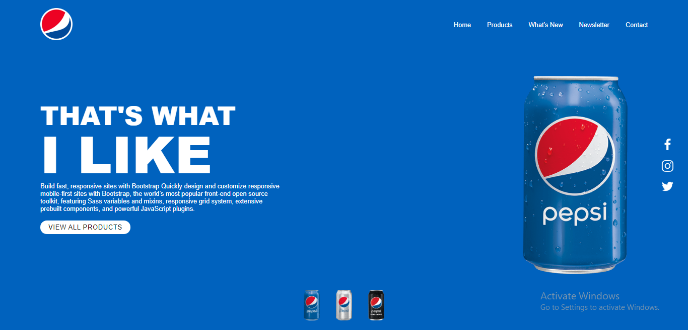
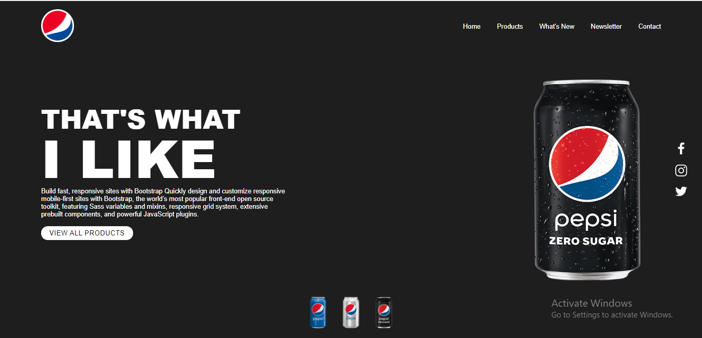

Created by Umashankar Pandey 
<a href="https://umashankar-pandey-portfolio.netlify.app">Here's my Portfolio</a> 

<a href="https://pepsi-demo-site.netlify.app/">Here's the App Live</a>

- Its a demo site created using Html, Css, JavScript

- Its just a Landing page of pepsi . It was my first project when I started doing coding. 

- I just created this on 2/08/2019. Its year now .Today I got this on my recycle Bin and I just updated it using onClick event on small pepsi items. When we click on the pepsi they page get updated by background change and that specific bottle appers !!

 

- Its a simple one page site
- Its open source you can go ahead and do changes whatever you wanna do !!